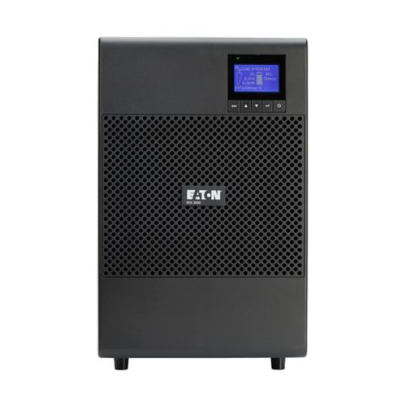

# Inventari d’equips

Llista dels dispositius que es connectaran al SAI i justificació:

- **4 Ordinadors:** Són els equips principals. Si s’apaguen bruscament, es podria perdre informació i causar errors.  
- **4 Monitors:** Necessaris per veure què passa als ordinadors i apagar-los correctament.  
- **Impressora:** Si està imprimint documents importants, un tall de llum podria malmetre la impressió o el dispositiu.  
- **Router d’accés a Internet:** Manté la connexió de xarxa, important per servidors, correu electrònic i serveis en línia.

## Especificacions tècniques

- **Ordinadors:** ThinkCentre Neo 55s Gen 6 SFF (AMD)  
  Preu: 613,20 $  
  Consum: 200 W (eficiència 90 %) → VA ≈ 285,7 VA  

- **Monitors:** ThinkCentre M70a Gen 6 (24" Intel)  
  Preu: 1029 $  
  Consum: 90 W (eficiència 89 %) → VA ≈ 128,6 VA  

- **Impressora:** Brother DCP-L3560CDW Multifunció  
  Preu: 278,99 $  
  Consum: imprimint 560 W → VA ≈ 800 VA  

- **Router:** Fortinet FortiGate 40F  
  Preu: 425,44 $  
  Consum: 15,4 W → VA ≈ 22 VA  

## Càlcul de potència total

**Potència en W:**

- Ordinadors: 4 × 200 W = 800 W  
- Monitors: 4 × 90 W = 360 W  
- Impressora: 560 W  
- Router: 15,4 W  

**Total:** 1735,4 W  
**Amb reserva del 20 %:** 2083 W  

**Potència en VA:**

- Ordinadors: 4 × 285,7 VA ≈ 1142,8 VA  
- Monitors: 4 × 128,6 VA ≈ 514,4 VA  
- Impressora: 800 VA  
- Router: 22 VA  

**Total:** 2479,2 VA  
**Amb reserva del 20 %:** 2975 VA  

## Determinació de l’autonomia

- Temps mínim: 10 minuts = 0,166 hores  
- Potència amb reserva: 2083 W  
- **Bateria mínima:** 2083 W × 0,166 h ≈ 345 Wh  

El SAI hauria de tenir com a mínim **345 Wh** per assegurar 10 minuts d’autonomia.

## Recerca de models de SAI

| Model | Potència | Preu |
|-------|----------|------|
| APC Easy UPS SRV3KRI | 3000 VA / 2700 W | 1.145,42 USD |
| Eaton 9SX 3000i | 3000 VA / 2700 W | 1.883,00 € |
| CyberPower PR3000ERT2U | 3000 VA / 2700 W | 1.539,90 € |

# Informe tècnic

## Càlculs realitzats

Connectarem al SAI els quatre ordinadors, quatre monitors, la impressora i el router.

- **Ordinadors:** 200 W cadascun, 285,7 VA  
- **Monitors:** 90 W cadascun, 128,6 VA  
- **Impressora:** 560 W, 800 VA  
- **Router:** 15,4 W, 22 VA  

**Potència total:** 1735,4 W (sense marge)  
**Amb reserva del 20 %:** 2083 W  
**Potència total en VA:** 2479,2 VA  
**Amb reserva del 20 %:** 2975 VA  

**Autonomia mínima:** 10 minuts per guardar treballs i apagar correctament  
**Bateria mínima necessària:** 2083 W × 0,166 h ≈ 345 Wh  

## Models analitzats

- **APC Easy UPS SRV3KRI** – 3000 VA / 2700 W, 1.145,42 USD  
- **Eaton 9SX 3000i** – 3000 VA / 2700 W, 1.883,00 €  
- **CyberPower PR3000ERT2U** – 3000 VA / 2700 W, 1.539,90 €

## Justificació de la selecció final

He triat el **Eaton 9SX 3000i** perquè ofereix més eficiència i protecció avançada, assegurant que els equips estiguin millor protegits davant talls de llum i problemes elèctrics.

