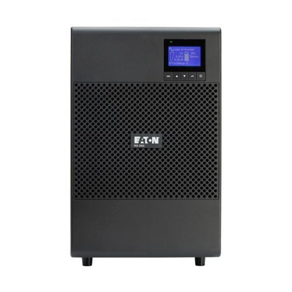

# Informe tècnic

## Càlculs realitzats

Connectarem al SAI els quatre ordinadors, quatre monitors, la impressora i el router.

- **Ordinadors:** 200 W cadascun, 285,7 VA  
- **Monitors:** 90 W cadascun, 128,6 VA  
- **Impressora:** 560 W, 800 VA  
- **Router:** 15,4 W, 22 VA  

**Potència total:** 1735,4 W (sense marge)  
**Amb reserva del 20%:** 2083 W  
**Potència total en VA:** 2479,2 VA  
**Amb reserva del 20%:** 2975 VA  

**Autonomia mínima:** 10 minuts per guardar treballs i apagar correctament  
**Bateria mínima necessària:** 2083 W × 0,166 h ≈ 345 Wh

---

## Models analitzats

- **APC Easy UPS SRV3KRI** – 3000 VA / 2700 W, 1.145,42 USD  
- **Eaton 9SX 3000i** – 3000 VA / 2700 W, 1.883,00 €  
- **CyberPower PR3000ERT2U** – 3000 VA / 2700 W, 1.539,90 €

---

## Justificació de la selecció final

He triat el **Eaton 9SX 3000i** perquè ofereix més eficiència i protecció avançada, assegurant que els equips estiguin millor protegits davant talls de llum i problemes elèctrics.

