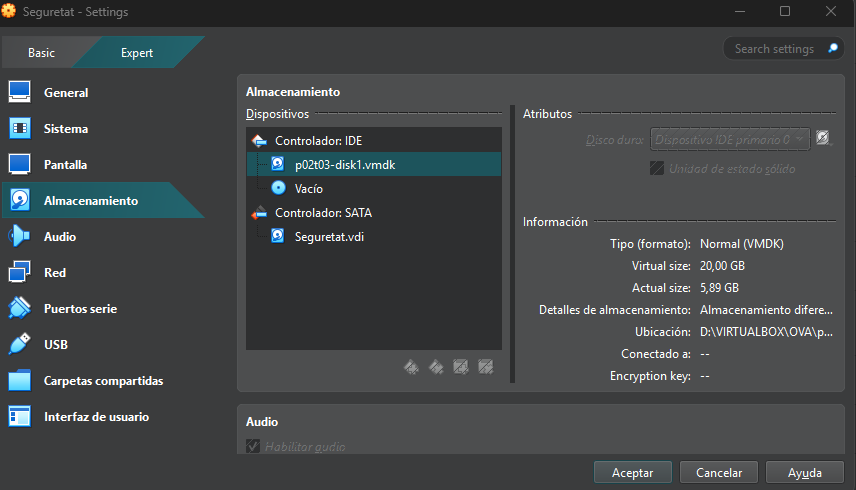
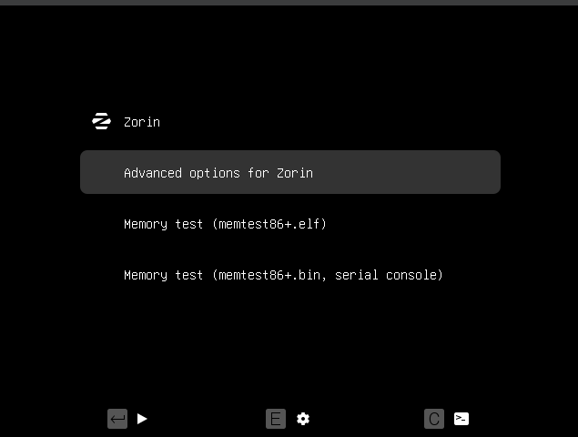
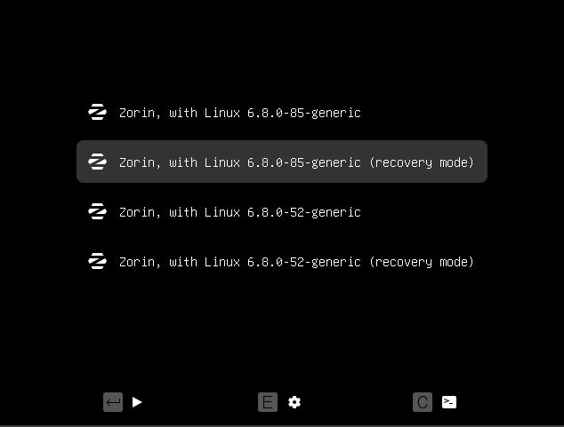
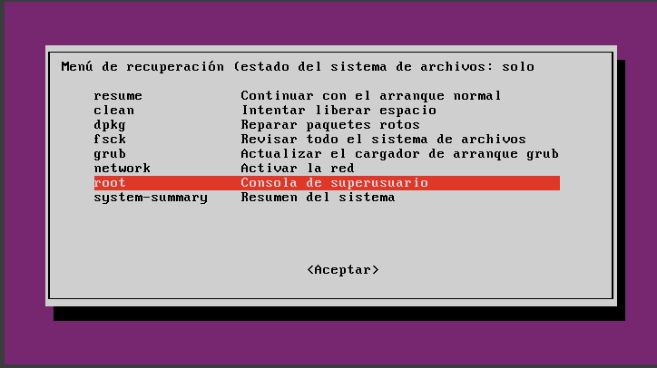
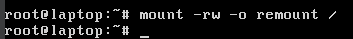
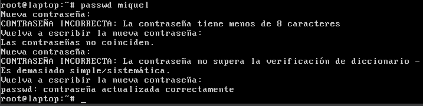
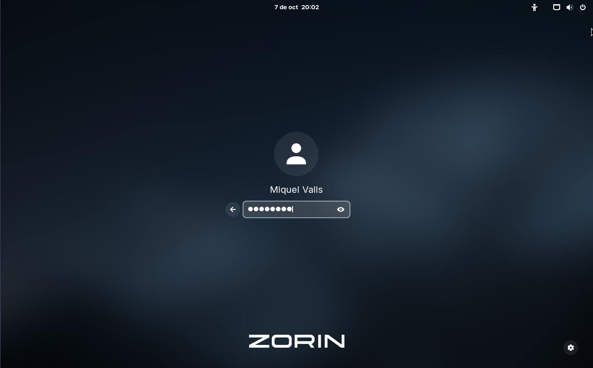
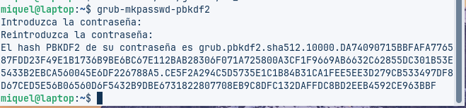
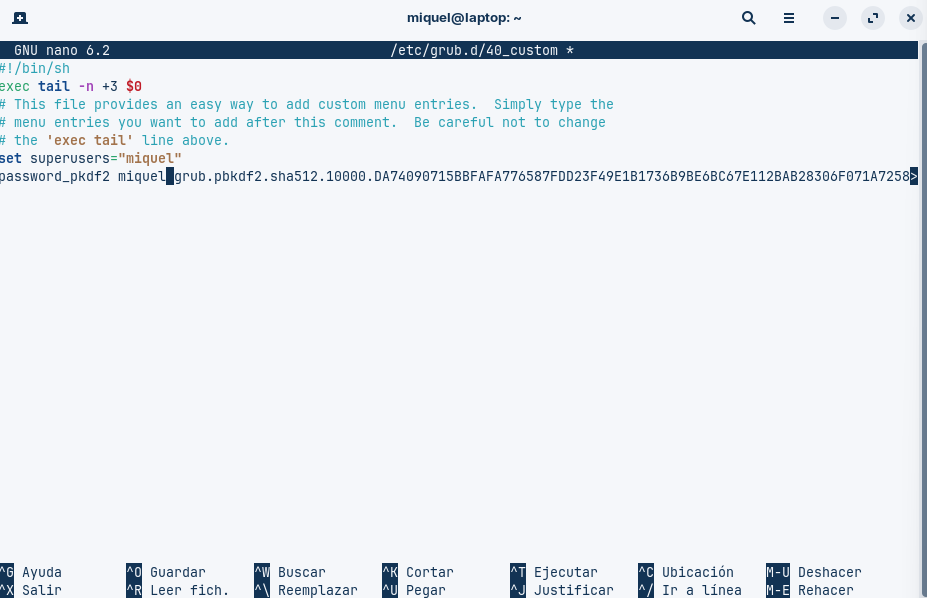
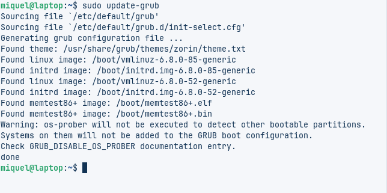

# GUIA T03

## INSTAL.LACIÓ DISC DUR
Primer de tot, he instal·lat el disc dur a la màquina virtual.

## CANVIAR LA CONTRASENYA
En engegar la màquina, premem el botó Shift i s’obrirà aquest menú. Després, triem la segona opció: “Advanced options for Zorin”.

Ara s’obrirà aquest menú, on seleccionarem la segona opció: “Zorin, with Linux 6.8.0-85-generic (recovery mode)”.

Ara s’obrirà aquest menú i triarem l’opció que diu “root”.

Ara posarem “mount -rw -o remount /” per poder canviar la contrasenya.

Ara utilitzarem la comanda passwd miquel per canviar la contrasenya de l’usuari miquel.

Una vegada canviat la contrasenya reinciciarem la maquina y al inciciar sesio posarem la contrasenya feta

 
## RECERCA DE FORTIFICACIÓ GRUB
### 1. Posar contrasenya
Per evitar que qualsevol pugui modificar l’arrencada, es pot configurar GRUB perquè demani contrasenya. Primer es genera un codi segur amb `grub-mkpasswd-pbkdf2`. Aquest codi es posa al fitxer `/etc/grub.d/40_custom` amb la línia `password_pbkdf2 usuari hash_generat`. Després cal actualitzar GRUB amb `sudo update-grub`. Així, només els usuaris autoritzats podran fer canvis.

### 2. Limitar canvis del menú
Només l’usuari amb contrasenya podrà editar el menú de GRUB, iniciar en mode recuperació o triar altres sistemes operatius. Això protegeix el sistema d’entrades no autoritzades i evita que algú pugui accedir a informació sensible o modificar fitxers importants des del mode recuperació.

### 3. Consells de seguretat addicionals
- Amaga el menú GRUB configurant `GRUB_TIMEOUT_STYLE=hidden` si no necessites veure’l cada cop que arrenca el sistema.  
- Posa contrasenya a la BIOS o UEFI per protegir tot el procés d’arrencada.  
- Revisa periòdicament la configuració del GRUB per assegurar-te que no hi ha hagut modificacions no autoritzades.  
- Assegura’t que la màquina virtual o el PC físic estigui protegida amb usuari i contrasenya, especialment si altres persones poden accedir-hi.

## FORTIFICAR L'ACCES AL GRUB

Ara posem la comanda de “grub-mkpasswd-pbdf2” per generar el hash de la contrasenya

Per reforçar l’accés al GRUB, escriurem la comanda: sudo nano /etc/grub.d/40_custom.

En executar aquesta comanda s’obrirà la pantalla on introduirem aquestes dues línies. 
set superusers="miquel"
password_pbkdf2 miquel hash_de_la_contrasenya

I després, per actualitzar el GRUB, escriurem sudo update-grub.

